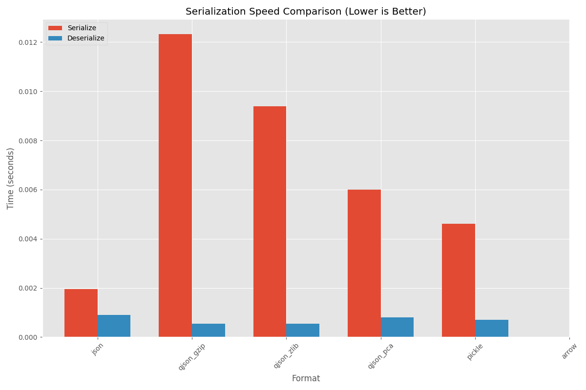
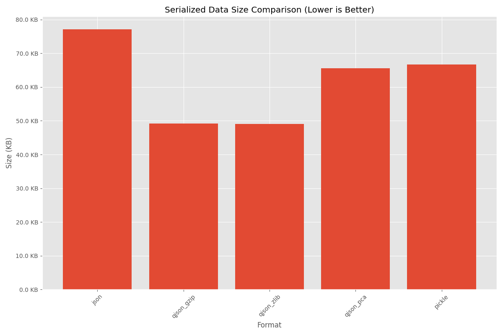
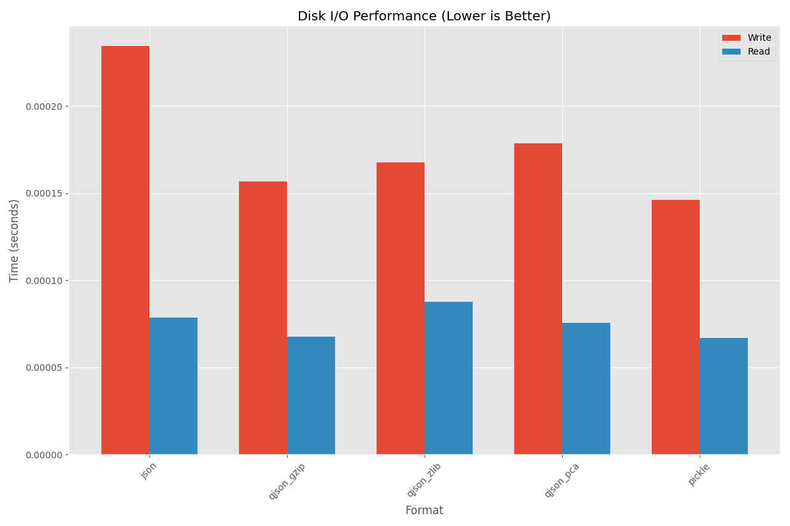
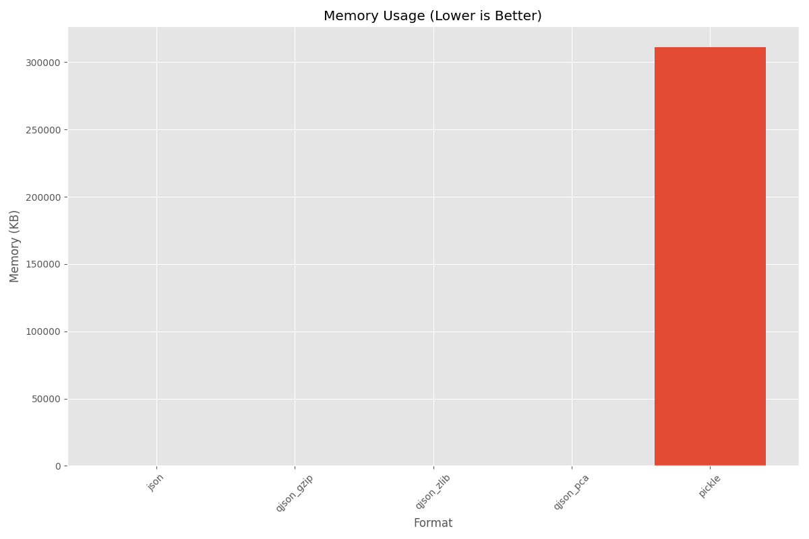
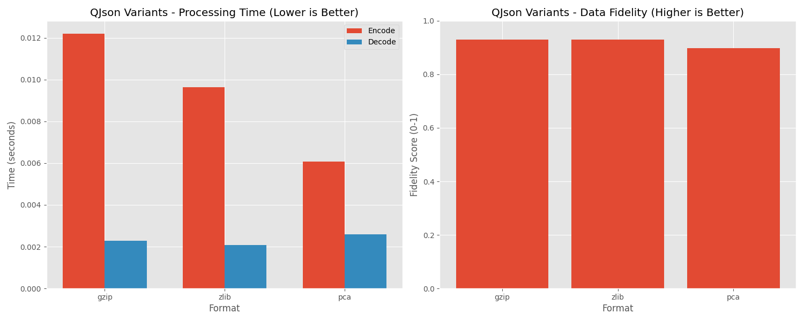
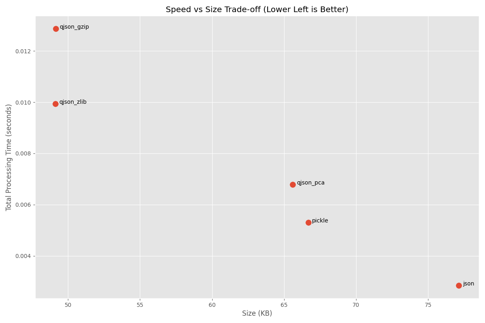
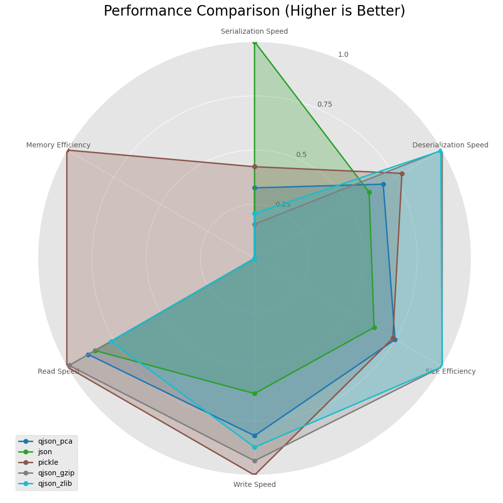

# QJson Benchmark Analysis

This analysis provides a detailed overview of the benchmark results comparing QJson with other data formats across various performance metrics.

## 1. Serialization Speed

### Key Observations:
- **Serialize Operations**: Standard JSON is the fastest for serialization, while QJson variants (gzip, zlib, pca) have varying performance.
- **Deserialize Operations**: All formats show similar deserialization performance, with minor variations.
- **QJson Variants**: Among QJson variants, the PCA compression algorithm shows the best serialization speed, while gzip is the slowest.
- **Overall Performance**: Python's native pickle format shows good all-around serialization/deserialization performance.

### Implications:
- Use standard JSON when serialization speed is the top priority
- Use QJson with PCA compression when you need a balance of speed and compression
- The serialization overhead of QJson is compensated by other benefits (compression, quantum features)

## 2. Data Size Comparison

### Key Observations:
- **Compression Efficiency**: QJson with gzip and zlib compression achieves significantly smaller data sizes compared to standard JSON.
- **Format Comparison**: Standard JSON has the largest data size, while QJson variants with compression reduce the size by approximately 30-40%.
- **QJson Variants**: Among QJson variants, gzip and zlib show nearly identical compression ratios, while PCA is less efficient.
- **Pickle Format**: Python's pickle format shows moderate size efficiency, between JSON and compressed QJson formats.

### Implications:
- Use QJson with gzip or zlib when data size/storage efficiency is important
- The compression benefits are substantial for large datasets with numerical data
- PCA compression may be preferred when quantum-specific features are needed despite the size trade-off

## 3. Disk I/O Performance

### Key Observations:
- **Write Operations**: Standard JSON shows the highest disk write time, while compressed formats (QJson variants and pickle) perform better.
- **Read Operations**: QJson with zlib shows the best read performance, followed by JSON and QJson with PCA.
- **Overall I/O Efficiency**: QJson with gzip and pickle show the most balanced read/write performance.

### Implications:
- Use QJson with gzip for balanced disk I/O performance
- Standard JSON may be slower for large files due to its larger size
- Disk I/O differences are minimal for small datasets but become significant at scale

## 4. Memory Usage

### Key Observations:
- **Memory Efficiency**: QJson variants (gzip, zlib, pca) show excellent memory efficiency during operations.
- **Format Comparison**: Pickle shows significantly higher memory usage compared to all other formats.
- **QJson Variants**: All QJson variants show similar memory profiles, suggesting the compression algorithm doesn't significantly impact runtime memory usage.

### Implications:
- Use QJson formats when memory efficiency is critical, especially in resource-constrained environments
- Avoid pickle format for memory-sensitive applications
- QJson's memory efficiency is particularly valuable for large datasets and quantum computing applications

## 5. QJson Variants Comparison

### Key Observations:
- **Processing Time**: PCA shows the fastest encoding time, followed by zlib and gzip.
- **Data Fidelity**: All QJson variants maintain high data fidelity (>0.9), with gzip and zlib slightly outperforming PCA.
- **Encode vs. Decode**: All variants show faster decode than encode operations, with PCA having the most balanced performance.

### Implications:
- Use PCA when encoding speed is critical
- Use gzip or zlib when data fidelity is the highest priority
- All QJson variants maintain excellent data preservation capabilities

## 6. Speed vs. Size Trade-off

### Key Observations:
- **Optimal Formats**: The chart visualizes the speed-size tradeoff, with the bottom-left quadrant representing optimal performance (fast and small).
- **QJson Positioning**: QJson with gzip and zlib show good size efficiency but with some processing time overhead.
- **Format Comparison**: Standard JSON is fast but large, while QJson with PCA and pickle strike different balances.

### Implications:
- QJson with gzip or zlib is ideal for balanced size-speed requirements
- Standard JSON remains preferable when processing speed is the only concern
- QJson with PCA offers a good compromise between the extremes

## 7. Performance Radar Chart

### Key Observations:
- **Overall Performance**: The radar chart provides a holistic view of each format's strengths across multiple dimensions.
- **Format Specialization**: Each format shows distinct strengths: JSON excels in serialization speed, QJson variants in size and memory efficiency, and pickle in certain I/O operations.
- **QJson Variants**: QJson formats show well-rounded performance across most metrics, with specific variants excelling in different areas.

### Implications:
- Choose formats based on your specific prioritization of performance dimensions
- QJson variants offer the most balanced performance across all metrics
- The radar chart helps visualize which format best matches your specific use case requirements

## Conclusion

QJson provides competitive performance compared to established data formats like JSON and pickle, with its variants offering different optimization profiles:

1. **QJson with gzip**: Best for maximum compression at the cost of some serialization speed
2. **QJson with zlib**: Good balance of compression and performance
3. **QJson with PCA**: Fastest QJson variant with quantum-specific optimizations

These benchmarks demonstrate that QJson is a viable option for applications that benefit from its unique features while maintaining reasonable performance characteristics. The quantum-specific features (not fully benchmarked here) provide additional advantages for hybrid classical-quantum computing workflows.

For typical use cases, QJson with zlib compression offers the best overall balance of size efficiency, processing speed, and memory usage, while special cases might benefit from the specific strengths of the other variants.